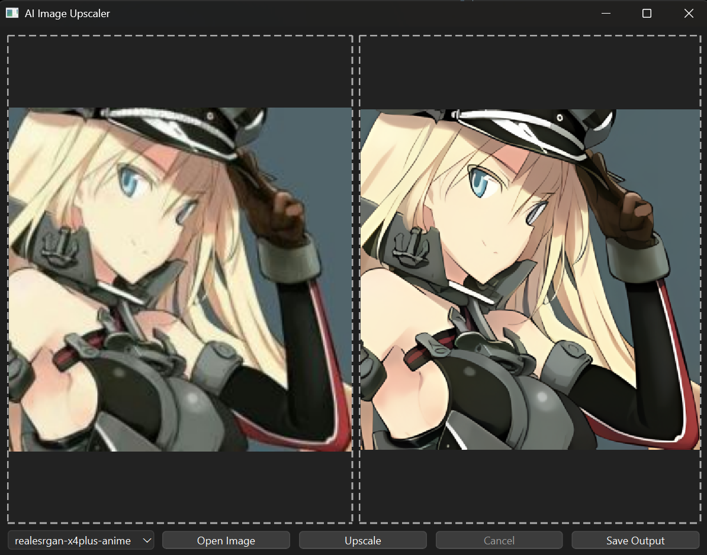
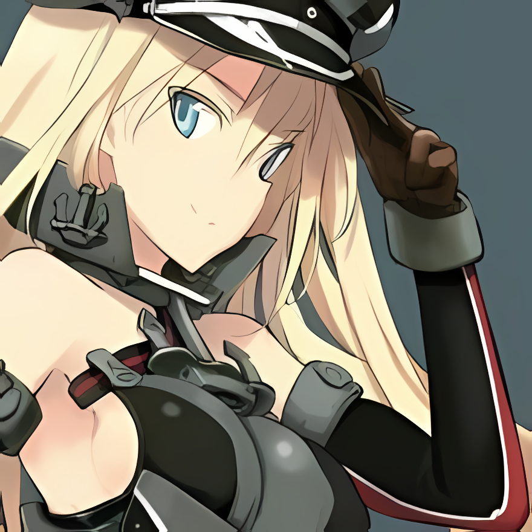

# AI Image Upscaler

A Python GUI application for upscaling low-resolution images using AI models (Real-ESRGAN).

## Features

- Simple drag-and-drop or file dialog image selection
- Multiple model selection (e.g., realesrgan-x4plus-anime, realesrgan-x4plus)
- Progress bar and cancel support during upscaling
- Preview of input and upscaled output images
- Save upscaled images in PNG or JPEG format

## Requirements

- Python 3.8+
- [PySide6](https://pypi.org/project/PySide6/)
- [Pillow](https://pypi.org/project/Pillow/)
- Real-ESRGAN NCNN Vulkan executable (`bin/realesrgan-ncnn-vulkan.exe`)

## Installation

1. Clone this repository or download the source code.
2. Install dependencies:

   ```
   pip install -r requirements.txt
   ```

   Or manually:

   ```
   pip install PySide6 Pillow
   ```

3. Download the Real-ESRGAN NCNN Vulkan executable and place it in the `bin` directory.

## Usage

Run the application:

```
python src/main.py
```

### UI


- Click "Open Image" or drag an image into the input area.
- Select the desired model from the dropdown.
- Click "Upscale" to start processing.
- Save the output using "Save Output".

## Sample Images
- Input image
- Image resolution - 220x220


- Output image after upscaling
- Upscaled image resolution - 880x880



## List of Models
1) realesrgan-x4plus
   - Best suited for upscaling real world images.
2) realesrgan-x4plus-anime
   - Best suited for upscaling only anime art style images.

## Supported Formats

- Input: PNG, JPG, JPEG, BMP
- Output: PNG, JPG, JPEG

## Credits

- [Real-ESRGAN](https://github.com/xinntao/Real-ESRGAN) for the upscaling models and engine.
- PySide6 for the GUI framework.

---
